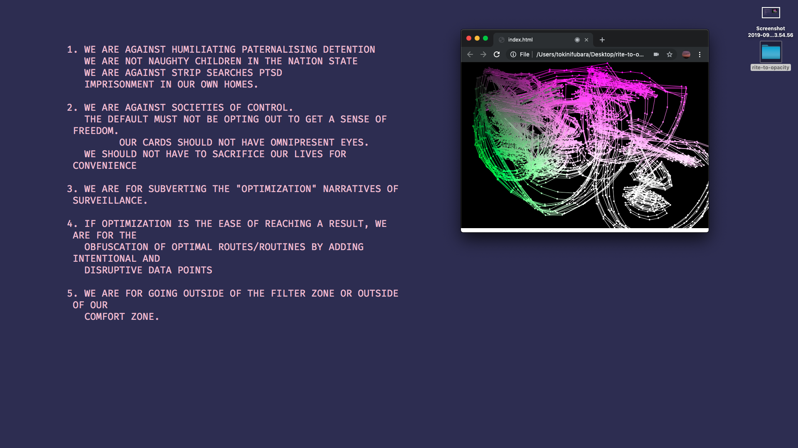

# RITE TO OPACITY: A MANIFESTO AGAINST BIOMETRIC SURVEILLANCE

1. WE ARE AGAINST HUMILIATING PATERNALISING DETENTION  
   WE ARE NOT NAUGHTY CHILDREN IN THE NATION STATE  
   WE ARE AGAINST STRIP SEARCHES, PTSD, AND  
   IMPRISONMENT IN OUR OWN HOMES.

2. WE ARE AGAINST SOCIETIES OF CONTROL.  
   THE DEFAULT MUST NOT BE OPTING OUT TO GET A SENSE OF FREEDOM.  
 	 OUR CARDS SHOULD NOT HAVE OMNIPRESENT EYES.  
   WE SHOULD NOT HAVE TO SACRIFICE OUR LIVES FOR CONVENIENCE
   
3. WE ARE FOR SUBVERTING THE "OPTIMIZATION" NARRATIVES OF SURVEILLANCE.
 
4. IF OPTIMIZATION IS THE EASE OF REACHING A RESULT, WE ARE FOR THE  
   OBFUSCATION OF OPTIMAL ROUTES/ROUTINES BY ADDING INTENTIONAL AND  
   DISRUPTIVE DATA POINTS/NOISE.

5. WE ARE FOR GOING OUTSIDE OF THE FILTER ZONE OR OUTSIDE OF OUR  
   COMFORT ZONE.
   
  THIS IS OUR RITE/RIGHT TO OPACITY

---

Created as part of a workshop in *Higher Resolution* by Hyphen-Labs at
Tate Exchange on September 28, 2019, this manifesto demands opacity from surveillance.

After the particpants collectively created this manifesto, the workshop facilitator (Tokini)
performed the utterance of the demands while running a [face detection program](https://github.com/stc/face-tracking-p5js).